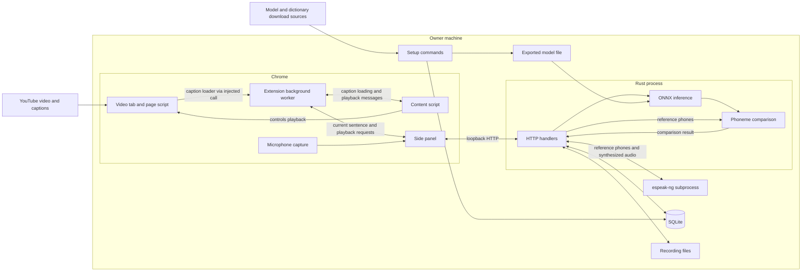

# System architecture

This document owns the description of component boundaries, relationships, data flows and local deployment topology. It records the implementation observed on 2026-10-03; it does not introduce a new architectural decision or certify a running installation.

Product identity and purpose: [PRD-001](../product/PRD-001-hear-the-sounds-you-miss.md). Required outcomes and their current status: [requirements](../requirements.md). Reasons for the architecture: [ADR-0002](../adr/ADR-0002-local-server-and-extension.md). Exact API shapes, schema, ports and versions remain in the sources listed in the [source map](../README.md).

## System context and deployment

The owner runs Chrome and a separately started Rust service on the same machine. The extension presents the interaction beside the video; the service performs local speech processing and persistence. The current site integration is declared by the [manifest](../../extension/manifest.json). Product positioning does not expand those permissions.

The setup commands are separate from the serving process. Model export uses a Python environment; runtime inference happens inside Rust. Dictionary setup downloads and imports data into the local store. Video and caption access still involves the video provider; local scoring is not a claim that the whole application works without a network. Installation commands belong in [README](../../README.md), with setup implementation in [main](../../src/main.rs) and the [model export tool](../../tools/export_onnx.py).

## Responsibilities and boundaries

| Component | Responsibility and boundary | Implementation evidence |
|---|---|---|
| Page script | Runs in the video page's main world; observes caption responses, reads text tracks and can fetch captions using the page session | [page.js](../../extension/page.js), [manifest](../../extension/manifest.json) |
| Content script | Associates captions with the playing video, forms the current sentence, handles range-adjust messages (no control sends them since 2026-10-05) and controls original playback | [content.js](../../extension/content.js), [sentence.js](../../extension/sentence.js) |
| Background worker | Bridges page/content-script messages and the panel; stores the latest caption state in memory | [background.js](../../extension/background.js) |
| Side panel | Displays sentences and words, calls the local API, records the owner's microphone and renders results | [sidepanel.js](../../extension/sidepanel.js) |
| Microphone support | A permission page requests access; an audio worklet collects samples, and pure audio helpers prepare the upload | [mic.js](../../extension/mic.js), [recorder-worklet.js](../../extension/recorder-worklet.js), [audio.js](../../extension/audio.js) |
| HTTP service | Enforces request access policy, validates requests and coordinates speech work and storage | [server.rs](../../src/server.rs), [OpenAPI](../../contracts/openapi/openapi.json) |
| Speech processing | Generates reference phones/audio through espeak-ng, recognizes recorded phones through ONNX and compares phone sequences | [espeak.rs](../../src/espeak.rs), [asr.rs](../../src/asr.rs), [align.rs](../../src/align.rs), [wav.rs](../../src/wav.rs) |
| Persistence | Stores structured records in SQLite and recording bytes in files; model files are separate runtime inputs | [store.rs](../../src/store.rs), [server.rs](../../src/server.rs), [paths.rs](../../src/paths.rs) |

SQLite and ONNX run inside the Rust process; espeak-ng is a child process. Database access and model inference are protected by separate mutexes in the service. Blocking speech work is dispatched away from async request handling. This is the observed execution structure, not a throughput or latency guarantee; see `App`, `blocking` and `recognize` in [server.rs](../../src/server.rs).

## Principal data flows

### Pick and revisit a sentence

For REQ-001 and REQ-003, the content script asks the background worker to load captions. The worker invokes the page loader in the page's main world and returns its result. The content script combines caption pieces and publishes the active sentence to the worker; the panel reads that state. Saving a selection sends its text and source context to the local service, which persists a card. Sentence boundaries are defined by the existing requirement and tests, not by this diagram.

For REQ-004, the panel asks the worker to find the original video tab. The worker forwards playback to that tab's content script, which operates the video element. Original video audio is played by the browser; it is not sent through the server for pronunciation scoring or archived as the owner's recording.

Evidence: [content](../../extension/content.js), [background](../../extension/background.js), [panel](../../extension/sidepanel.js), [card handlers](../../src/server.rs).

### Look up a word and hear a reference

For REQ-002, the panel sends a word to the service, which reads the local dictionary. Saving the word preserves its source context in the store. Reference speech and individual reference phones use the service's espeak-ng integration. Dictionary definitions and synthesized pronunciation are distinct from the original speaker's audio.

Evidence: [panel](../../extension/sidepanel.js), [lookup and speech handlers](../../src/server.rs), [dictionary lookup](../../src/store.rs). Speech-engine rationale belongs in [ADR-0004](../adr/ADR-0004-espeak-ng-for-reference-phones-and-audio.md).

### Record, compare and retain an attempt

For REQ-005/006, the panel obtains microphone permission, captures samples and uploads a WAV recording associated with an existing card or word. The service decodes the audio, obtains reference phones from the stored text, recognizes the owner's recording and compares the two sequences. It saves recording bytes and the attempt's structured result, then returns the result to the panel.

The reference branch and recognition branch meet in the alignment module. The reference is generated from text, not extracted from the video's original speech. The product implications and unresolved connected-speech question belong in [PRD-001](../product/PRD-001-hear-the-sounds-you-miss.md); model rationale belongs in [ADR-0003](../adr/ADR-0003-phoneme-model-wav2vec2-onnx.md).

Audio files and SQLite records are separate writes. Attempt handlers attempt to remove the newly written file if insertion reports an error, but this is not one transaction spanning the filesystem and database. A process interruption between writes is therefore a recovery concern (inferred from write ordering). Exact scoring rules are in [SPEC-001](../specs/scoring.md); recording states and failure semantics are in [SPEC-002](../specs/recording.md).

Evidence: [panel recording](../../extension/sidepanel.js), [score_recording and attempt handlers](../../src/server.rs), [alignment](../../src/align.rs), [store](../../src/store.rs).

## Trust boundaries

The page's main world is exposed to the video website. Caption data crosses from that world into extension logic through the background worker's injected call. Those captions are external input, not a trusted source of application commands. The extension's declared access is owned by the [manifest](../../extension/manifest.json).

The panel crosses a second boundary when it calls the local HTTP service. The service's access policy and its limitations are defined in [ADR-0001](../adr/ADR-0001-local-api-access-control.md), implemented by `guard_local_access` in [server.rs](../../src/server.rs). This policy is not authentication of a particular extension or local process; see the ADR's known risks. Microphone permission is a separate browser-controlled boundary, exercised by [mic.js](../../extension/mic.js) and the panel.

Model files and dictionary downloads enter through setup, while recordings and cards enter through runtime requests. The runtime service reads and writes with the owner's filesystem permissions. Storage compatibility and migration policy belong in [ADR-0005](../adr/ADR-0005-sqlite-and-local-files.md) and executable migrations in [store.rs](../../src/store.rs); changing branding does not itself authorize moving existing data.

## Failure and operational boundaries

- The browser and service have independent lifetimes. The panel checks service health; it cannot start the Rust process. See [panel](../../extension/sidepanel.js) and [CLI](../../src/main.rs).
- Service initialization represents a missing or failed model explicitly, so it can still serve non-scoring operations. Model and speech-engine readiness are reported through the API. Exact responses belong in [OpenAPI](../../contracts/openapi/openapi.json), with implementation in [server.rs](../../src/server.rs).
- Schema initialization errors prevent normal service startup. Backup and rollback steps are documented in the [recovery runbook](../runbooks/recovery.md); the disposable file-copy exercise passed, and remaining limits are listed in [status](../status.md).
- The background worker's latest caption is transient. Durable cards, words and attempts live behind the service; see [background](../../extension/background.js) and [store](../../src/store.rs).
- Local process diagnostics and live health responses describe actual state. The [CI workflow](../../.github/workflows/ci.yml) validates code; it does not deploy or monitor the owner's installed application.

## Verification and traceability

These are existing verification sources, not claims that they were executed for this documentation change.

| Architectural relationship | Requirement or decision | Verification sources |
|---|---|---|
| Page to extension caption flow | REQ-001, ADR-0002 | [page tests](../../test/page.test.js), [content tests](../../test/content.test.js), [background tests](../../test/background.test.js), [sentence tests](../../test/sentence.test.js) |
| Panel lookup, selection and playback | REQ-002/003/004 | [panel tests](../../test/sidepanel.test.js), [background tests](../../test/background.test.js), server tests in [server.rs](../../src/server.rs) |
| Microphone through scoring and persistence | REQ-005/006, ADR-0003/0004/0005 | [microphone tests](../../test/mic.test.js), [audio tests](../../test/audio.test.js), [worklet tests](../../test/recorder-worklet.test.js), panel tests, inline tests in speech and storage modules |
| Local API and process boundary | ADR-0001/0002 | Server access tests, [contract tests](../../src/contract.rs), [CLI tests](../../tests/cli.rs) |
| Storage compatibility | ADR-0005 | Migration tests in [store.rs](../../src/store.rs) |

Browser scripts are tested in simulated environments and speech modules use test fixtures where appropriate. These checks do not establish live YouTube compatibility, real microphone behavior or model accuracy. Commands belong in [README](../../README.md); current verification gaps belong in [status](../status.md).
